# FitAura
W dzisiejszych czasach bardzo powszechne jest prowadzenie odpowiedniej diety oraz reguralne
sprawdzanie podstawowych pomiarów medycznych. 

Głównym celem projektu jest udostępnienie platformy, która pozwoli w prosty sposób
zapisywać posiłki, które spożyliśmy w ciągu dnia oraz zapisywać nasze aktywności w ciągu
dnia tj. spalone kalorie, liczba kroków, jakość snu oraz pomiary medyczne.

## Główne funkcjonalności
- rejestracja / logowanie
- zarządzanie naszym dniem:
  - zapisywanie zjedzonych przez nas posiłków (produktów / przepisów)
  - możliwość prowadzenia dzienniczka aktywność (spalone kalorie, jakość snu, liczba kroków, podstawowe pomiary medyczne)
- obliczanie deficytu kalorycznego na podstawie bieżącej wagi oraz wzrostu
- automatycznie zliczanie spożytej liczby kalorii wciągu dnia oraz makro składników (białka, węgli oraz tłuszczy)
- statystyki z danego okresu:
  - średnie (jakości snu, zjedzonych kalorii, liczby kroków, tętna, cukru)
  - wykres bmi
- posiłki:
  - mogą składać się z przepisu lub produktu
  - możemy podać ile gramów zjedliśmy danego produktu i przeliczone zostaną odpowiednio kalorie oraz makroskładniki
  - mozemy podać ile gramów / bądź kcal chcemy zjeść w danym przepisie i zostanie odpowiednio przeliczone ile składniku danego uzyć
  - podgląd posiłku, nazywanie posiłku
- przepisy
  - tworzenie własnych przepisów
  - edytowanie przepisów
  - zaawansowane wyszukiwanie przepisów poprzez (kategorie, zakres kcal, rosnąco / malejąco, autora przepisu, po nazwie)
- profil użytkownika
  - zmiana danych typu waga, wzrost, hasło

## Innowacyjność
- Przepis przelicza nam składniki potrzebne do ugotowania dania względem spożytych kalorii.
- Ocena jakości snu w danym okresie (statystyka).
 
## Technologie

| Technologia / Pakiet | Wersja | Oficjalna strona |
| :--- | :--- | :--- |
| **.NET MAUI** | 10.0.20 | [dotnet.microsoft.com](https://dotnet.microsoft.com/apps/maui) |
| **Entity Framework Core** | 10.0.7 | [learn.microsoft.com](https://learn.microsoft.com/ef/core/) |
| **.ASP NET CORE** | 10.0.6 | [dotnet.microsoft.com](https://dotnet.microsoft.com/en-us/apps/aspnet) |
| **SWASHBUCKLE.ASP NET CORE** | 10.0.6 | [dotnet.microsoft.com](https://learn.microsoft.com/pl-pl/aspnet/core/tutorials/getting-started-with-swashbuckle?view=aspnetcore-8.0&tabs=visual-studio) |
| **MudBlazor** | 9.4.0 | [mudblazor.com](https://mudblazor.com/) |
| **Npgsql** | 10.0.1 | [npgsql.org](https://www.npgsql.org/efcore/) |
| **SkiaSharp** | 3.119.2 | [skiasharp.com](https://github.com/mono/SkiaSharp) |
| **ZXing.Net** | 0.16.11 | [github.com/micjahn/ZXing.Net](https://github.com/micjahn/ZXing.Net) |
| **ZXing.Net.Bindings.SkiaSharp**| 0.16.22 | [github.com/Redth/ZXing.Net.Bindings.SkiaSharp](https://github.com/Redth/ZXing.Net.Bindings.SkiaSharp) |
| **PostgreSQL** | 17 | [postgresql.org.pl](https://www.postgresql.org.pl)

## Wymagania do uruchomienia projektu

- **System operacyjny**: Windows 11
- **SDK**: .NET 10
- **Baza Danych**: PostgreSQL 17
  
*W chwilii obecnej aplikacja jest wyłącznie dostępna w wersji Desktopowej.*

## Instrukcja uruchomienia

1. Sklonowanie obu repozytoriów
- git clone https://github.com/xserafineq/FitAura
- git clone https://github.com/xserafineq/FitAuraApi

2. Migracja bazy danych
- dotnet ef database update fitauradb

3. Uruchomienie obu programów za pomocą komend
- (**FitAura**) dotnet run --framework net10.0-windows10.0.19041.0 
- (**FitAuraApi**) dotnet run --launch-profile https                     

  
## Podręcznik użytkownika

### Funkcjonalności

1. Rejestracja - każdy użytkownik na samym początku musi utworzyć konto, podając najważniejsze dane: imie, nazwisko, email, date urodzenia, wzrost oraz wagę.
   
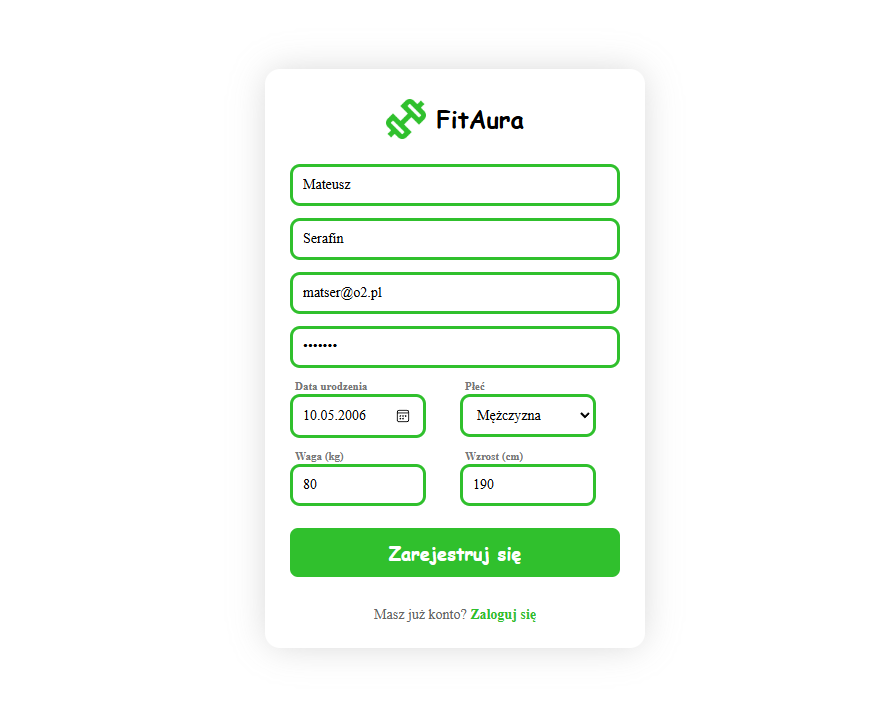

2. Logowanie - po utworzeniu konta, możemy się zalogować podając hasło i login.

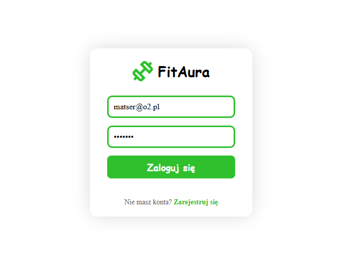

3. Dashboard - po podaniu poprawnych danych logowania, możemy przejść do dashboardu, które jest głównym centrum działania aplikacji. W nim użytkownik może dodawać nowo zdjedzone posiłki oraz zapisywać dzienne aktywności oraz pomiary medyczne.

- dashboard startowy (początek danego dnia)

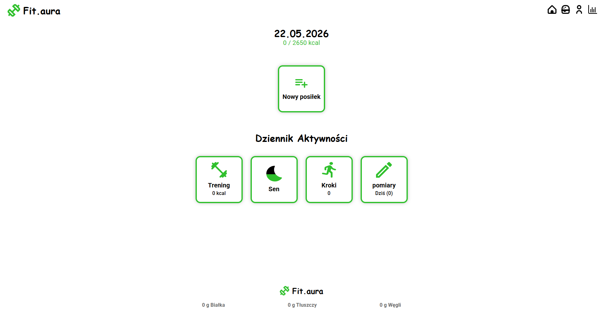

- dashboard uzupełniony

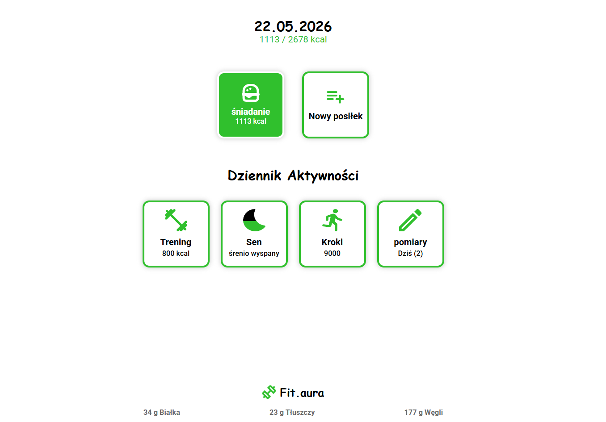

4. Aktywności - użytkownik może zapisywać dzienne aktywności (spalone kalorie, liczba kroków, jakość snu oraz pomiary medyczne).

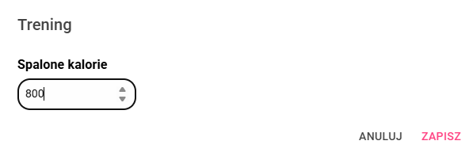
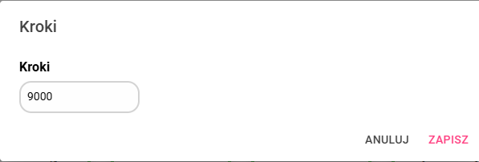
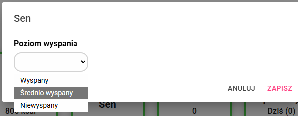
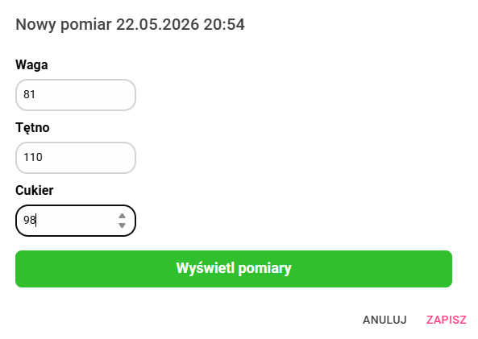

Użytkownik w ciągu dnia może wprowadzić wiele pomiarów, może również je edytować lub usunąć.
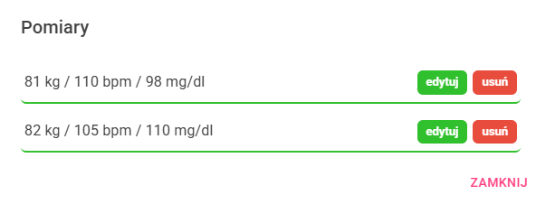
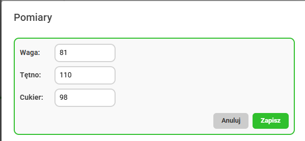

5. Posiłki - użytkownik w ciągu dnia może tworzyć wiele posiłku, nadawać im własną nazwę oraz przypisywać do nich dowolną ilość produktów lub przepisów w podanych przez siebie ilościach.

- zmiana nazwy posiłku z domyślnej

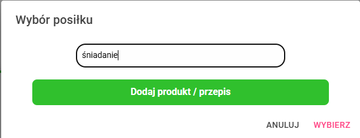

- dodanie produktu / przepisu do posiłku

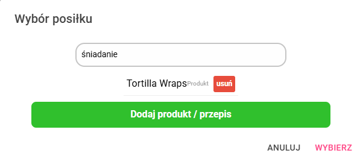

- po zakończeniu tworzenia przepis zostaje on dodany do ekranu głównego, gdzie widzimy jego nazwę oraz łączną kaloryczność

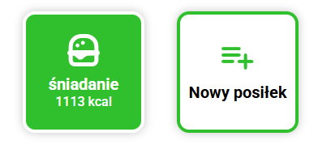

- możemy również po kliknięciu na posiłek podglądnąć z czego się składał

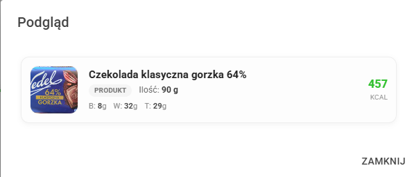

6. Przepisy - w aplikacji mamy dostępną bazę przepisów, która stale się rozwija, ponieważ jest ona tworzona przez użytkowników aplikacji.

- wyszukiwanie przepisów może odbywać się po kategorii, zakresie kaloryczności potrawy, autorze przepisu lub nazwie przepisu.

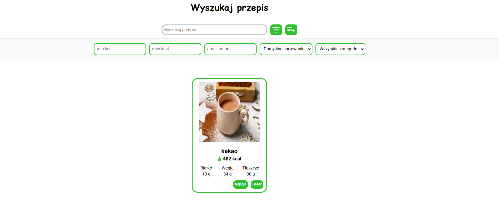
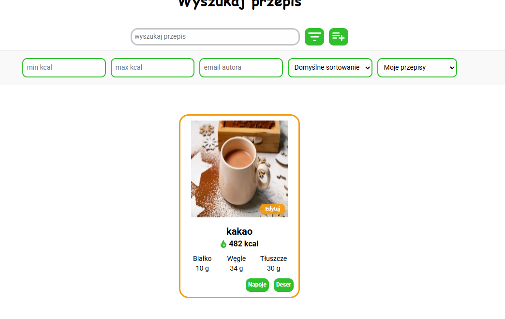

- po kliknięciu na przepis, możemy podglądnąć jego listę składników, kroki przygotowania oraz kaloryczność i makro składniki.

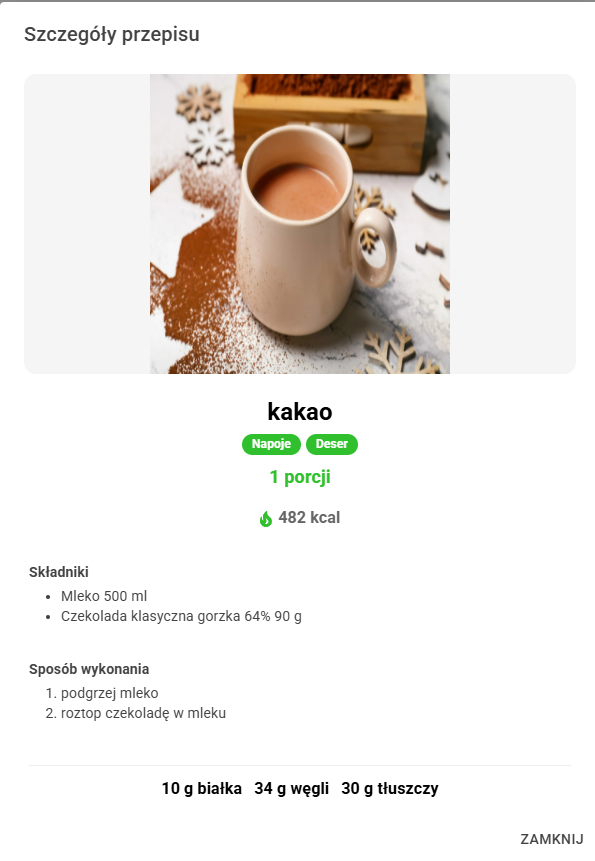

- możemy również dodać nowy przepis, poprzez kliknięcie na ikonkę plusa obok wyszukiwarki. Podczas dodawania przepisu uwzględniamy składniki (oraz ich ilość w g lub ml) oraz kroki przygotowania, a także nazwę oraz kategorię. Przepis możemy również edytować, po wyszukaniu przepisu po kategorii "Moje".

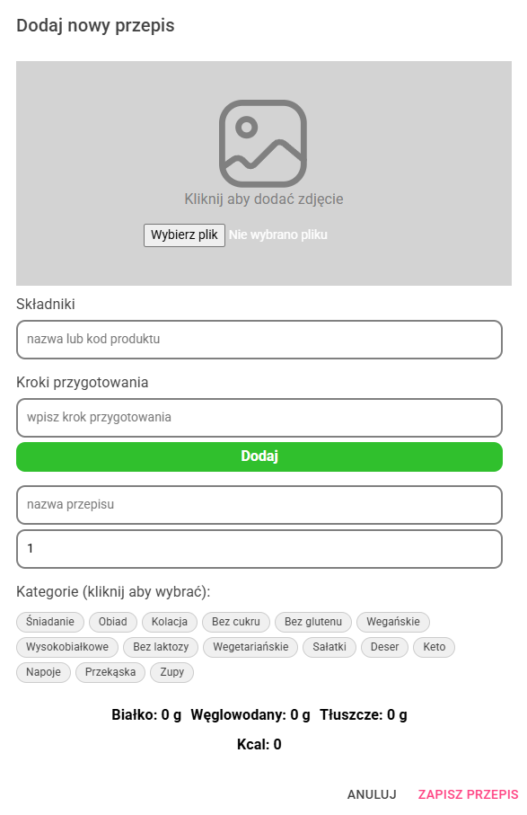

7. Profil użytkownika - użytkownik może zmienić swoje podstawowe dane, jak wzrost, wagę oraz hasło do konta.

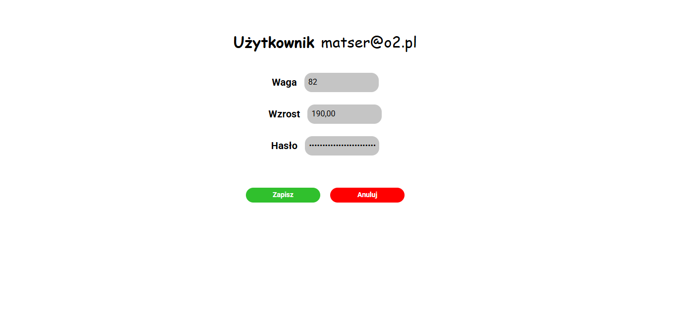

8. Statystyki - użytkownik może sprawdzić swoje statystyki ze wszystkich dni z danego zakresu. Dzięki temu może sprawdzić średnią ilość spalonych kalorii, liczbę kroków, średni poziom cukru oraz tętna, a także jakość snu oraz wykres bmi.

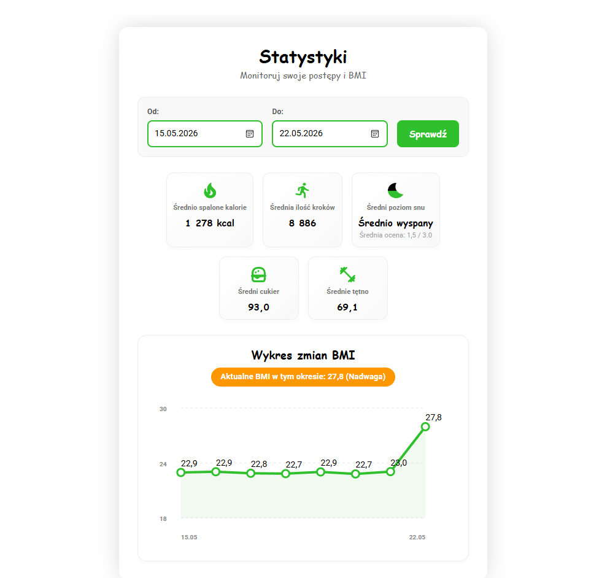

## Responsywność
Na poniższych zrzutach ekranu zaprezentowana jest responsywność aplikacji.
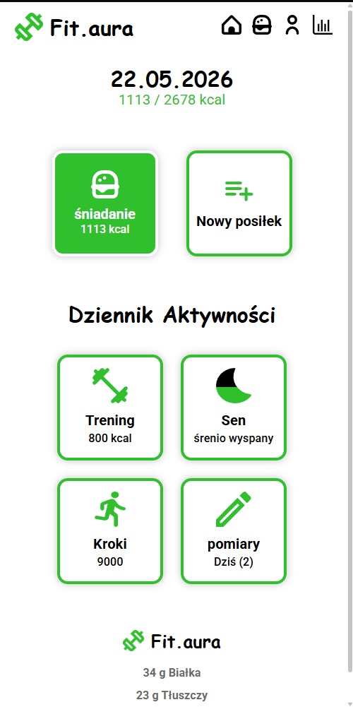
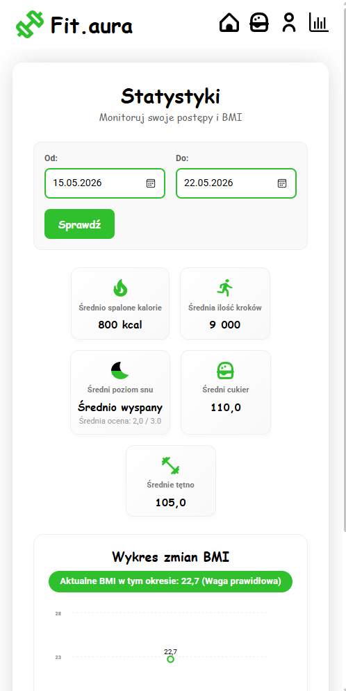
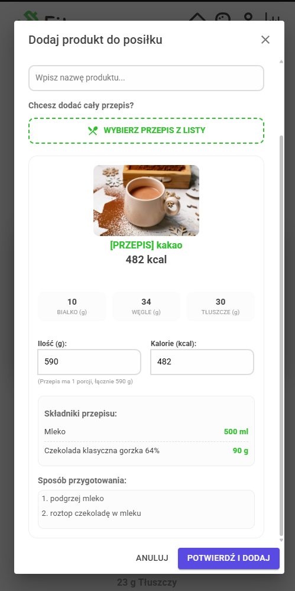

## Dalszy rozwój aplikacji
Jako dalszy rozwój aplikacji planowane jest wsparcie urządzeń mobilnych oraz wprowadzenie bardziej zaawansowanej filtracji przepisów, oraz dodanie możliwości zbierania większej ilości informacji, które użytkowników będzie mógł podsumować w statystykach.

